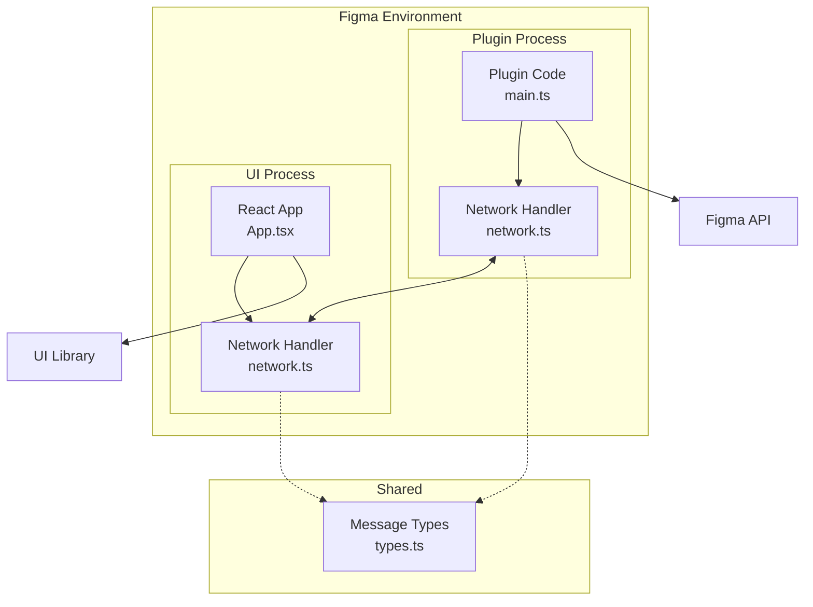
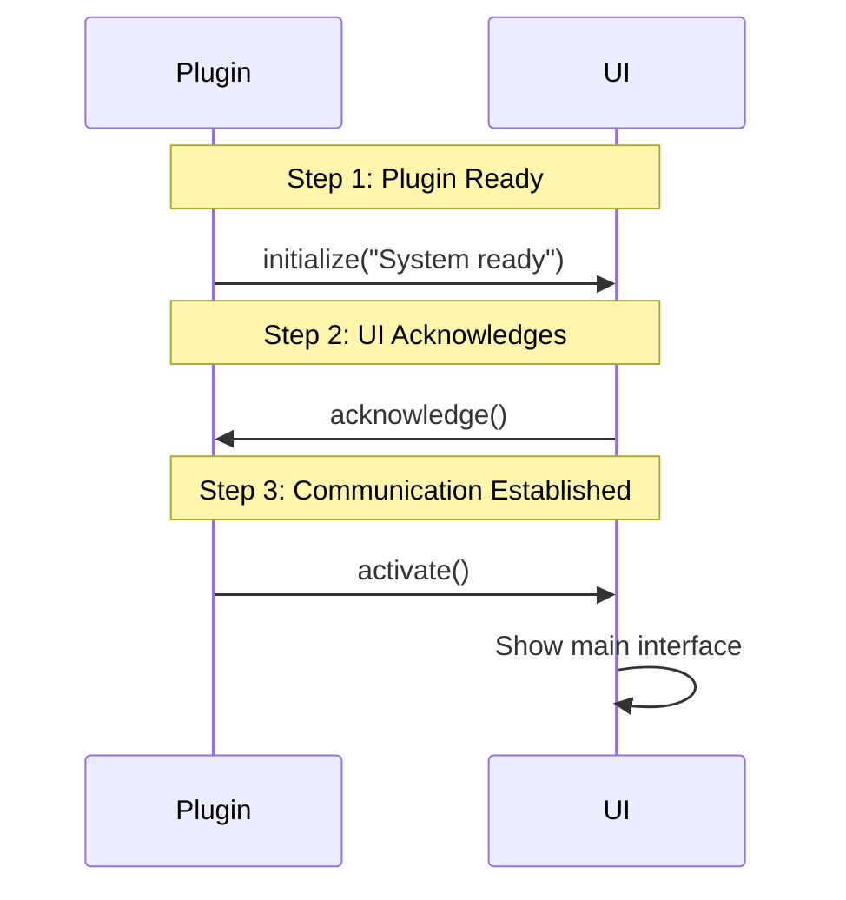
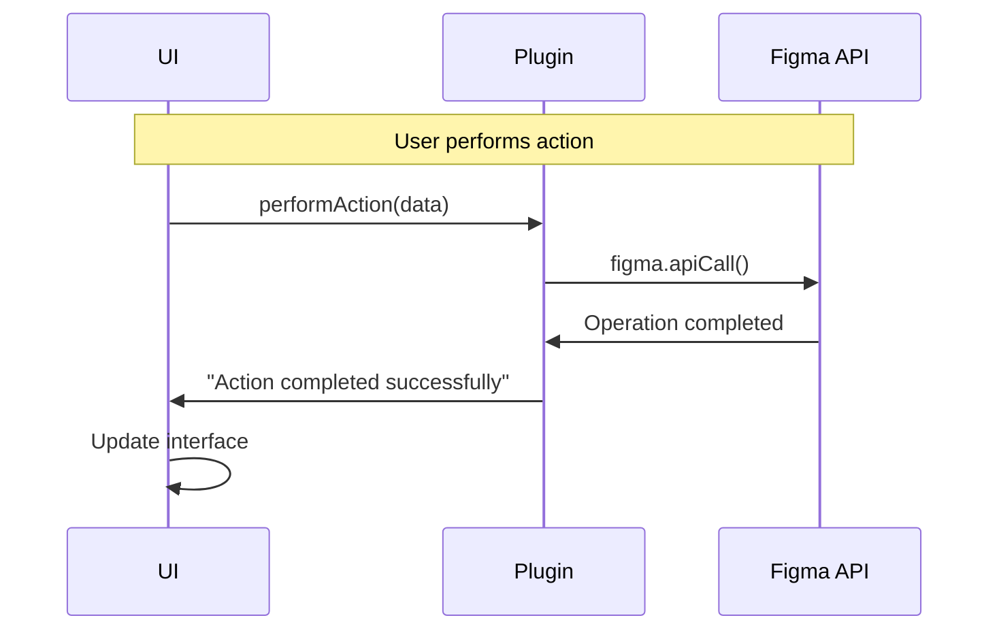
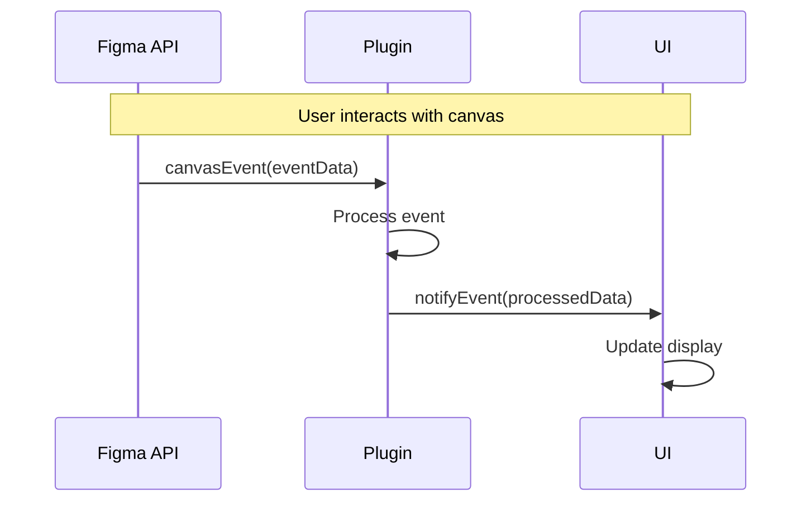
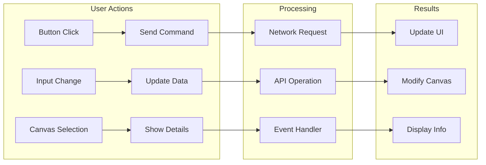

# Architecture Overview

## System Architecture

The plugin uses a **dual-process architecture** where the UI and plugin run in separate environments and communicate via type-safe messages.



## Communication Flow

### 1. Bootstrap Handshake

The plugin uses a 3-step handshake to ensure both sides are ready before showing the UI:



### 2. User Interactions

After bootstrap, all user interactions follow a request-response pattern:



### 3. Figma Events

The plugin listens to Figma events and notifies the UI:



## Key Components

### Plugin Process (`src/plugin/`)

- **Environment**: Figma's sandboxed JavaScript
- **Role**: Handles Figma API operations and events
- **Files**:
  - `main.ts` - Bootstrap and initialization
  - `network.ts` - Message handlers and API operations

### UI Process (`src/app/`)

- **Environment**: React app in iframe
- **Role**: Provides user interface and manages state
- **Files**:
  - `App.tsx` - React components and UI logic
  - `network.ts` - Network setup and message handling

### Network Layer (`src/common/`)

- **Purpose**: Type-safe communication between processes
- **Files**:
  - `types.ts` - Message type definitions and contracts

## Message Types

```typescript
// Plugin can receive these messages
PluginMessages<{
  executeCommand(params: CommandParams): Promise<Result>
  updateSettings(config: Settings): void
  requestData(query: DataQuery): Promise<Data>
}>()

// UI can receive these messages
UIMessages<{
  initialize(status: string): void
  activate(): void
  dataChanged(newData: Data): void
  eventNotification(event: Event): void
}>()
```

## Data Flow


